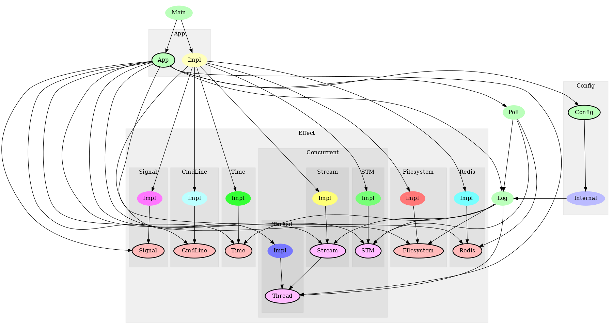
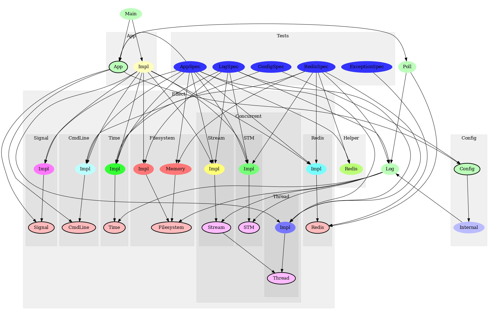

# Application template

This may be taken as starting point for an application project. Some parts are inspired by a design
pattern found [here](https://www.fpcomplete.com/blog/2017/06/readert-design-pattern). I decided
against the [RIO](https://www.fpcomplete.com/blog/2017/07/the-rio-monad) framework for the moment, it
seems to be a bit "too much".

## Generate html docs

- generate docs with `haddock.sh` (see output for path to index.html)
- generate `README.html` with `readme.sh` (needs the `markdown` tool to be installed)

## Generate module dependency graphs

- generate `src.png` and `test.png` with `dep.sh` (needs the `graphmod` tool)

## Module dependency graphs

- Source dependencies 
- Test code dependencies 
